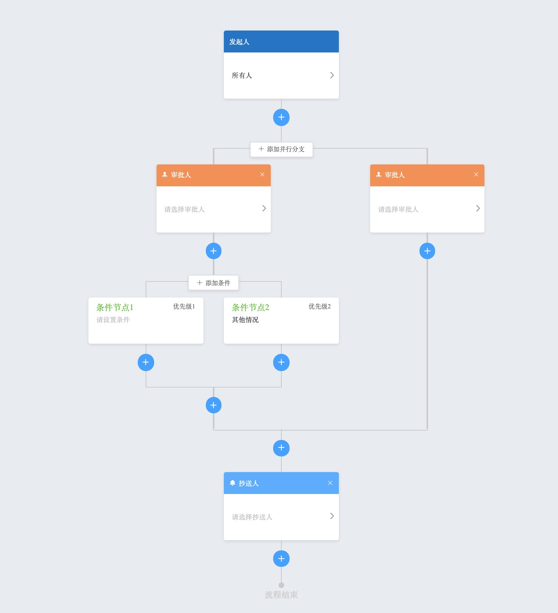

# flow-design-center

一个简单的流程图绘制工具。



## Features

- 内置发起人、审批人、并行分支、条件分支、抄送人等节点
- 支持自定义节点、扩展节点
- 内置数据结构(`LinkedList<Node>`, `FlowGraph<Node>`, `Array<Node>`)
- 支持自定义数据转换，内置 [toJSON]('./src/components/design-center/adapters/toJSON.js'), [toModel]('./src/components/design-center/adapters/toModel.js')

## Example

```bash
npm install
npm run serve
```

## License

MIT

## Thanks
